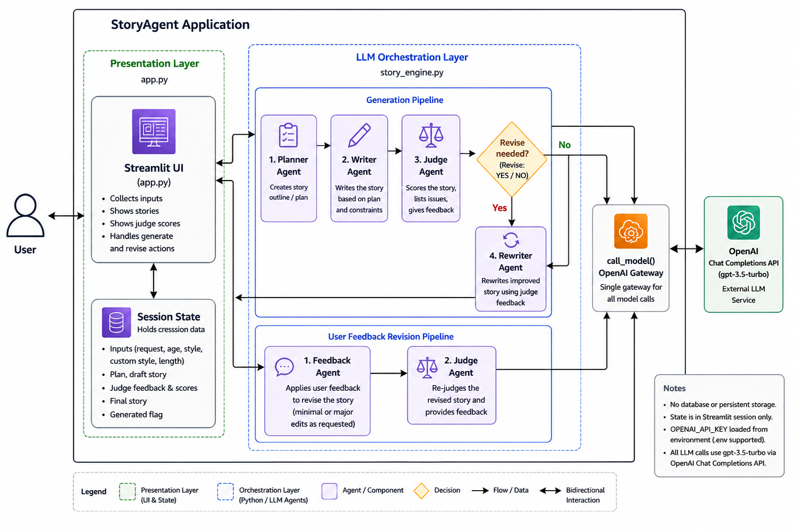

# StoryAgent: Bedtime Story Generator

A **Streamlit** web app that generates age-appropriate children's stories using **OpenAI**. It runs a small **multi-agent pipeline**: plan the story, write a draft, judge quality, optionally rewrite, then display results. You can also **revise** a finished story with natural-language feedback and get a fresh judge pass.

## Features

- **Story request**: free-text prompt for what happens in the story
- **Age range**: `5-7` or `8-10` (used in prompts for tone and complexity)
- **Story style**: presets (for example Calm & Cozy, Classic Bedtime) plus optional **custom style notes**
- **Length**: Short, Medium, or Long (word targets enforced in the engine where configured)
- **Judge summary**: scores parsed from structured judge output
- **Revision loop**: optional second pass from user feedback

## Requirements

- **Python 3.10+** (3.11 recommended)
- An **OpenAI API key** with access to **Chat Completions** for `gpt-3.5-turbo`
- Billing or quota on your OpenAI account (the app calls the API on each generate or revise)

## Quick start

### 1. Clone and enter the project

```bash
cd StoryAgent
```

### 2. Create a virtual environment

**Windows (PowerShell)**

```powershell
python -m venv .venv
.\.venv\Scripts\Activate.ps1
```

**macOS / Linux**

```bash
python3 -m venv .venv
source .venv/bin/activate
```

### 3. Install dependencies

```bash
pip install -r requirements.txt
```

### 4. Set your API key

**Option A: environment variable (recommended)**

Windows PowerShell:

```powershell
$env:OPENAI_API_KEY = "sk-..."
```

macOS / Linux:

```bash
export OPENAI_API_KEY="sk-..."
```

**Option B: `.env` file** (local only; do not commit)

Create a file named `.env` in the project root:

```env
OPENAI_API_KEY=sk-...
```

`story_engine.py` loads it via `python-dotenv`. `.env` is listed in `.gitignore`.

### 5. Run the app

```bash
streamlit run app.py
```

Open the URL shown in the terminal (usually `http://localhost:8501`).

## Project layout

| File | Role |
|------|------|
| `app.py` | Streamlit UI, session state, validation, calls into `story_engine` |
| `story_engine.py` | Prompts, agents, `generate_story_pipeline`, `revise_story_with_feedback`, OpenAI calls |
| `requirements.txt` | Python dependencies |
| `.gitignore` | Ignores `.venv`, `.env`, caches, IDE files, etc. |

## Architecture Diagram


## How it works

1. **Planner**: outline aligned to request, age, style, length
2. **Writer**: full story from the plan
3. **Judge**: scores plus "Revise: YES/NO" in a fixed format
4. **Rewriter**: runs only if the judge says yes
5. **User revise**: `feedback_agent` applies your edits, then **Judge** runs again

All model traffic goes through **`call_model`** and `openai.ChatCompletion.create` with **`gpt-3.5-turbo`**.


